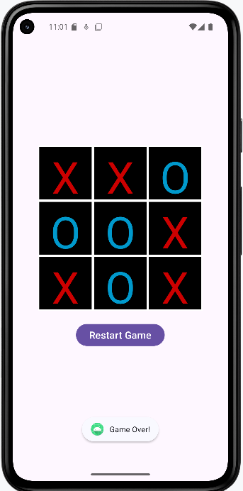

# 🎮 Grid O-X App (Tic Tac Toe)

A simple Grid O-X (Tic Tac Toe) Android application built using Java and XML in Android Studio.

---

## ✨ Toast Implemented
- Added Toast to display clicked cell and current player
- Implemented tag attribute for cell identification
- Improved click handling logic

---

## 🏆 Winner Detection
- Implemented winning logic using 1D array (gameState)
- Used 2D array to store all possible winning combinations
- Displays Toast message when X or O wins
- Stops game after winner is declared

---

## 🛠 Tech Stack
- Java
- XML
- Android Studio
- ConstraintLayout

---

## 📷 Screenshots

---

## 🚀 How to Run
1. Clone the repository
2. Open in Android Studio
3. Build & Run on Emulator

---

## 👨‍💻 Author
GIRJENDRA